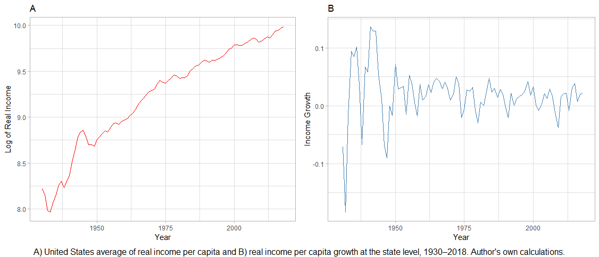
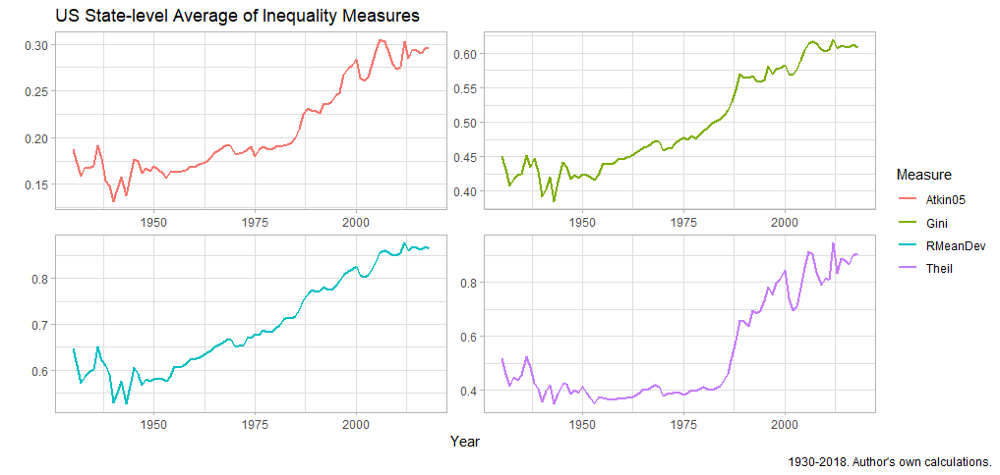

<!-- First: Set your default preferences for chunk options: -->

```{r setup, include=FALSE}
knitr::opts_chunk$set(echo = FALSE, message = FALSE, warning = FALSE, fig.width = 6, fig.height = 5, fig.pos="H", fig.pos = 'H')

library(pacman)
p_load("tidyverse", "panelvar", "scales", "vars")

```


<!-- ############################## -->
<!-- # Start Writing here: -->
<!-- ############################## -->

# Introduction \label{Introduction}

This paper attempts to replicate various parts of the paper by @atems. It will specifically emphasise the methodological approach used by these authors in an attempt to uncover whether their PVAR approach holds against further checks for robustness. As such, this paper will, like the authors, test the series for unit roots, whilst attempting to replicate the cumulative Impulse Response Functions (IRFs) for the baseline bivariate PVAR. Furthermore, we will test whether certain subsamples of observational units drive their results, something the authors did not consider.

The paper will be structured in the following manner: for completeness, a overview of the primary differences between the PVAR and VAR approaches will be given, after which the contribution of @atems will be discussed. Section \ref{Section 2.2} looks at their methodological approach through a critical lens, thereby also informing which robustness checks are considered the important ones to include in the current analysis.

\newpage

# Literature Review \label{Section 2}

## Panel Vector Autoregression \label{Section 2.1}

Panel Vector Autoregressions are, as the name suggests, a variation of the standard VAR approach applied to panel data. Panel data, in contrast to time series data, is comprised out of various cross-sectional units observed over time - in our case, states - meaning that a VAR approach to model interactions between endogenous variables need to account for the fact that the underlying structure might differ across these units. Whereas both VARs and PVARs treat all variables in a given system as endogenous, the PVAR approach thus allows for unobserved individual heterogeneity between the different cross-sectional units of observation. In order to overcome this difficulty, a PVAR approach therefore imposes an additional restriction, namely, that the underlying structure is the same for all of the units of analysis.

However, @love note that this restriction is highly likely to be violated in practice, consequently requiring circumvention. To this end, @love suggest the introduction of fixed effects that allow individual heterogeneity in the levels of the variables. Crucially, these fixed effects are correlated with the regressors because of the necessary inclusion of dependent variable lags in the model (the 'autoregressive' aspect of VARs), meaning that mean-differencing - the standard method used to eliminate fixed effects - will bias the regression coefficients. To solve this problem, @arellano advocate for the usage of the ‘Helmert procedure’, where the means of only the future observations for each unit is removed. This procedure therefore transforms the variables in a way that preserves the orthogonality between the variables and the lagged regressors - an important requirement for isolating shocks to the system. This, in turn, allows for the usage of the lagged regressors as instruments whereby the coefficients of the systems can be estimated. Moreover, these orthogonal relationships provide the necessary moment conditions that allow for VAR estimation using Generalized Method of Moments (GMM). 

## Inequality and Economic Growth [@atems] \label{Section 2.2}

@atems utilise a panel of annual state level income inequality data to consider the relationship between per capita income and income inequality using a panel VAR approach. This approach allows them to examine two things: first, the correlation between these variables, and second, the dynamic responses of both variables given shocks to income and inequality. The motivation for using a PVAR approach is that it captures more complexity than either standard VARs or traditional panel date models due to the allowance of dynamic effects and . It also does well at fitting the data, whilst being parsimonious enough without making strong identifying assumptions [@atems; @love]. Additionally, the inclusion of specifically state level panel data reduces possible measurement error due to greater homogeneity between states than, for instance, countries [@frank].

Their results are displayed using cumulative IRFs, which describe the response of one variable to the innovations in the other variable in the system.^[Cumulative IRFs must be interpreted as capturing the effect on the levels of the variables, and not their growth rates.] They find that shocks to inequality has significant negative effects on the level of income per capita. They also find that the relation between income per capita and inequality varies over time, and is sensitive to specific subsamples of time. Overall, their contribution is novel in that it is the first study to employ a panel VAR approach to estimate the effect of inequality on income per capita and vice versa by utilising US state-level data. In order to gauge whether their analysis is sufficiently specified, a brief overview of the data and employed methodology is discussed below. 

### Data {-}

There are three datasets used by @atems relevant to our discussion. The first, data on state-level economic growth, is measured by the annual change in per capita real income for the 48 contiguous US states, plus District of Columbia for the period 1930-2005.^[Hawaii and Alaska are therefore excluded.] The second series is state-level income inequality data (sourced by @frank), for the same period. Their measure of inequality, the Gini coefficient, is constructed using tax filing data.^[The usage of tax data is often considered problematic in that it excludes low-income earners, thereby introducing possibly misleading results. This possibility informs the authors' choice to check for robustness by using other inequality metrics.]

### Unit Root Testing {-}

The first step to any VAR study is to conduct unit root tests on the series of data. @atems perform five different unit root tests - which include the Fisher-type Augmented Dickey-Fuller (ADF), Levin-Lin-Chu (LLC), IM-Pesaran-Shin (IPS), Harris-Tzavalis (HT) and Hadri (LM) tests - on demeaned data.^[@levin suggest to perform these test on demeaned data, as it reduces the effects of dependence between cross-sectional units.] After using the Akaike Information Criterion (AIC) to choose the appropriate lag length of the tests. Although the first four tests reject the null hypothesis of a unit root, the Hadri test, which tests the null hypothesis of no unit root, cannot be rejected. This is interpreted as being sufficient evidence to suggest that nonstationarity might be present at a significance level of 5% in some of the series. In order to respond to this, the authors conclude that first-differencing is the appropriate response. As such, the PVAR is estimated on the differenced series of the data.

### Methodology {-}

The authors estimate a baseline structural bivariate VAR model of the growth rate of real income per capita and changes in the Gini index, whilst also implementing various robustness checks. These robustness checks include subsampling (structural break testing) on the time-period of analysis, as well as using three other  measures of inequality.^[These are the Relative Mean Deviation, the Theil Entropy Index, and the income share of the top income decile and top percentile of the state population. All measures are sourced from @frank.]

Their reduced-form empirical specification is as follows:

\begin{align}\tag{1}
Y_{it} = A(L)Y_{i,t-1} + \delta_i + \varphi_i + \varepsilon_{it} \hspace{12pt} \varepsilon_{it} ~ N(0, \Sigma_{i}), \label{eq1}
\end{align}

where $A(L)$ is the polynomial matrix of the lag operator $L$, $\delta_i$ is the unobservable time effects and $\varphi_i$ is a vector of constant-over-time fixed effects across states. $Y_{it}$ is equal to the vector of the growth rate of real income per capita ($\Delta y_{it}$) of state $i$ in year $t$, and the change in the Gini coefficient of state $i$ in year $t$ ($\Delta g_{it}$), thereby equaling $[\Delta y_{it} \Delta g_{it} ]'$. Further $\varepsilon_{i,t} = [\varepsilon_{i,t}^{\Delta y}  \varepsilon_{i,t}^{\Delta g}]'$, which denotes the vector of errors.

It is necessary to impose further structure on equation (\Ref{eq1}) to uncover the underlying structural behaviour of shocks to the system, and therefore to make IRFs interpretable. These restrictions are often untestable and must be guided by economic theory. There are two restrictions imposed on this system. The first is necessitated by the requirement of orthogonality due to the structure of panel data, and is discussed in Section \Ref{Section 2.1}. The second restriction is guided by economic theory, and is concerned with the ordering of the variables - there cannot be contemporaneous effects of changes in the Gini coefficient on economic growth. By employing a Cholesky decomposition, @atems argue that the Gini coefficient should be ordered second in the structural specification of the VAR. This argument is sound; the Gini coefficient is calculated using income data, meaning that there will be contemporaneous effects of changes on income on the Gini coefficient. The Gini coefficient, however, has delayed effects on income, a fact that is established in the literature [@cingano; @barro; @frankincome].

Therefore, incorporating these restrictions to the model and transforming the variables according to the Helmert procedure, one can specify the final transformed equation as taking the form: 

\begin{align}\tag{2}
\tilde{Y}_{it} = A(L) \tilde{Y}_{i, t-1} + \tilde{\varepsilon}_{i,t} \label{eq2}
\end{align}

In addition to the specificion above, @atems identify the cumulative IRF's using a Cholesky decomposition of the covariance matrix of the residuals, and decide on an arbitrary number of lags, arguing that four lags are sufficient to capture the system dynamics. The cumulative IRFs are given for a one standard deviation shock, with 5% confidence bands generated by Monte Carlo simulation methods.

### Overview and Extensions {-}

The VAR model by @atems seems to hold up to scrutiny. It is difference-stationary and accounts for the paneled aspects of the data. Furthermore, the ordering restriction is economically sound, and the data seems to be of good quality. Moreover, their initial specification holds up to robustness checks with respect to different inequality metrics and structural break tests. The authors also insulate themselves against possible criticism when it comes to omitted variable bias by including another variable, human capital, and re-estimating the VAR as a trivariate model. However, their metric of 'human capital' - average years of schooling per state - seems to be fairly simplistic. Arguments can be made for a more nuanced metric that includes labour market information.^[For instance, an inclusion of labour force participation rates, unemployment figures or a variable measuring average work experience might be suitable.]

Given these factors, several extensions to this study can nonetheless be identified. The first is to extend the model to include new data from 2005 to 2018, which, at the time of writing, was not available to the authors. Another extension to consider would be the inclusion of state subsamples delineated according to geographical regions. The intuition behind the latter is to ascertain whether some regions drive the results found by @atems, which would add more nuance to their analysis. For the purposes of this study, emphasis will be placed on extending the model to include the new data, and to include these regional subsamples. Additionally, the authors do not explicitly provide diagnostic tests such as autocorrelation functions (ACFs) or Q-stats, important tools with which to check for white noise errors. This would be a further extension to consider. The subsequent section attempts the abovementioned.

\newpage 

# Replication \label{Section 3}

## Descriptive Statistics  \label{Section 3.1}

In order to prove that the replicated study uses the same series as the original, as well as to visualise the additional data from 2005-2018, descriptive statistics on the US income and inequality series will now be given. Figure [\ref{Fig1}] below displays the per capita real income and per capita real income growth for the United States as a whole, averaged at the state level. When looking at @atems, it is clear that the same data is being used.

```{r Fig1, fig.cap="\\label{Fig1}", echo = FALSE, message = FALSE, warning = FALSE, out.width="100%", fig.height = 5, fig.pos="H"}



```

In terms of inequality metrics, Figure [\ref{Fig2}] gives the state-average inequality measures from 1930 to 2018. This graph replicates the same graph in @atems. However, it is important to note that the current analysis will emphasise only the Gini-coefficient, as the robustness checks performed by @atems with respect to different measures were deemed adequate for our purposes.

```{r Fig2,fig.cap="\\label{Fig2}", echo = FALSE, message = FALSE, warning = FALSE, out.width="100%", fig.height = 5, fig.pos="H"}



```


## Unit Root Tests \label{Section 3.2}

We employ three tests for unit roots^[The Fischer-type ADF, LLC and IPS tests. The HT test was excluded as it was not available on the statistical program this study employed.], and one explicitly for stationarity^[The Hadri LM test.]. Like @atems, these tests are performed on demeaned data, and the panel data is balanced. Our results are displayed in the Appendix, section \Ref{A}. Our results, which include the new data from 2005 to 2018, mirror their findings. Although the three unit root tests indicate stationarity in levels for both income per capita and inequality, the Hadri test indicates that the null of no unit roots cannot be rejected for the series of both variables. All tests indicate stationarity in the growth rates of the two variables. 

- ACF's? Checking for White Noise Errors

- IRF's

- State Subsample

## Results Baseline PVAR \label{Section 3.3}

The baseline PVAR estimated in this section will follow the same methodology described in @atems, using equation \ref{eq2}.  

## Regional Subsamples \label{Section 3.4}


# Conclusion


\newpage

# References {-}

<div id="refs"></div>

\newpage

# Appendix {-}

## Unit Root Test Results \label{A}

```{r unit1, , echo = FALSE, fig.show='hold', fig.align='center', message = FALSE, warning = FALSE, out.width="49%", out.height="35%", fig.pos="H"}
knitr::include_graphics("images/Gini_Levels_Intercept.png")
knitr::include_graphics("images/Gini_Levels_Trend.png")

```


```{r unit2, , echo = FALSE, fig.show='hold', fig.align='center', message = FALSE, warning = FALSE, out.width="49%", out.height="35%", fig.pos="H"}
knitr::include_graphics("images/Income_Levels_Intercept.png")
knitr::include_graphics("images/Income_Levels_Trend.png")

```


```{r unit3, , echo = FALSE, fig.show='hold', fig.align='center', message = FALSE, warning = FALSE, out.width="49%", out.height="35%", fig.pos="H"}
knitr::include_graphics("images/Gini_Growth_Intercept.png")
knitr::include_graphics("images/Gini_Growth_Trend.png")

```


```{r unit4, echo = FALSE, fig.show='hold', fig.align='center', message = FALSE, warning = FALSE, out.width="49%", out.height="35%", fig.pos="H"}

knitr::include_graphics("images/Income_Growth_Intercept.png")
knitr::include_graphics("images/Income_Growth_Trend.png")

```

